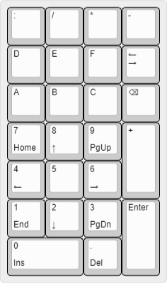

# HexKeypad

Goal of the project is to make a hex keypad that's similar to 
[IPv6 Buddy](https://www.ipv6buddy.com/), but... better.

- Open source
- Mechanical key switches
- Target use cases
  - IPv4 addresses (Decimal digits, `.`)
  - IPv6 addresses (Hexadecimal digits, `:`)
  - MAC addresses (Hexadecimal digits, `:`, `.`, `-`)
  - Arithmetic (`+`, `-`, `*`, `/`)
  - Misc Keys (Tab, Backspace, Enter)
- No double colon key (`::`) - IPv6 Buddy may have it, but it's silly.
- Big enter key
- Retain the typical keypad layout as much as possible

# License

MIT License.  Do whatever you want with this.  I'm not responsible if 
my schematics are wrong, PCB design is jacked up, or whatever.

# Contributing

You're more than welcome to contribute.  If you test something, and it works out,
I'd love to hear about it.  If you have any suggested changes, please feel free to
file an issue, or open a pull request.

# Next Step

Next step is to test the schematic.  I purchased some buttons [like these](https://p.globalsources.com/IMAGES/PDT/B0979968856/tact-tactile-switch-push-button-switch.jpg),
and I'm going to wire it all up on a breadboard, and make sure the key matrix works the way
I intended.  While I'm at it, I plan on hooking up a microcontroller and testing the firmware
to make sure that it works right.

# Parts

- Key switches
  - 22x 1x1
  - 3x 1x2
- Plate
- PCB
- Microcontroller
  - Shooting for a Teensy 2.0, shouldn't need to upgrade to a Teensy++.
- 3D printed case
- Misc electronics parts (resisters, etc)

# Tasks

- ✔️ **Design layout** 
  - Status: Done
  - [Layout file](Layout/hex-keypad.json)
- ⚠️**Schematic**
  - Status:
    - Complete
    - Not tested
    - Need to wire up a breadboard w/ key switches to test schematic
  - [KiCad Project](Schematics%20and%20PCB/Keyboard/Keyboard.pro)
  - [Schematic File](Schematics%20and%20PCB/Keyboard/Keyboard.sch)
- ⚠️**Firmware**
  - Status:
    - Complete
    - Not tested
    - Need to test after testing the schematics.
  - [Configuration](Firmware/hexkeypad.json)
- ⚠️**PCB**
  - Status:
    - Complete
    - Not tested
    - Need to validate schematic and firmware via breadboard before ordering a prototype board
  - [KiCad Project](Schematics%20and%20PCB/Keyboard/Keyboard.pro)
  - [Schematic File](Schematics%20and%20PCB/Keyboard/Keyboard.kicad_pcb)
- ⚠️**Plate**
  - Status:
    - Completed
    - Not tested
    - Need to validate schematic / PCB before spending any more time/effort on manufacturing/testing.
  - [CAD file](Plate/Keyboard.dxf)
  - [SVG](Plate/Keyboard.svg)
- ❌ **Case**
  - Status:
    - WIP
    - I don't even want to _try_ to "finish" this until the PCB/plate are validated.
  - [Case design](Case/Hex%20Keypad.f3z)

# Tools

- [Keyboard Layout Editor](http://www.keyboard-layout-editor.com/)
- [Keyboard Firmware Builder](https://kbfirmware.com/)
- [KiCad](https://www.kicad.org/)
- [Plate & Case Builder](http://builder.swillkb.com/)
- [Fusion 360](https://www.autodesk.com/products/fusion-360/overview) (free [hobby license](https://www.autodesk.com/products/fusion-360/personal))